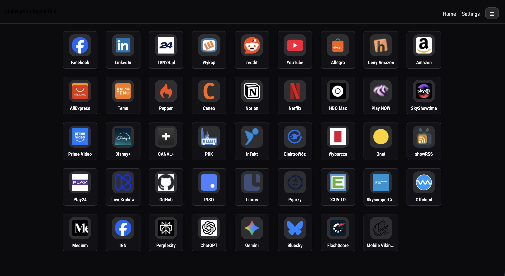
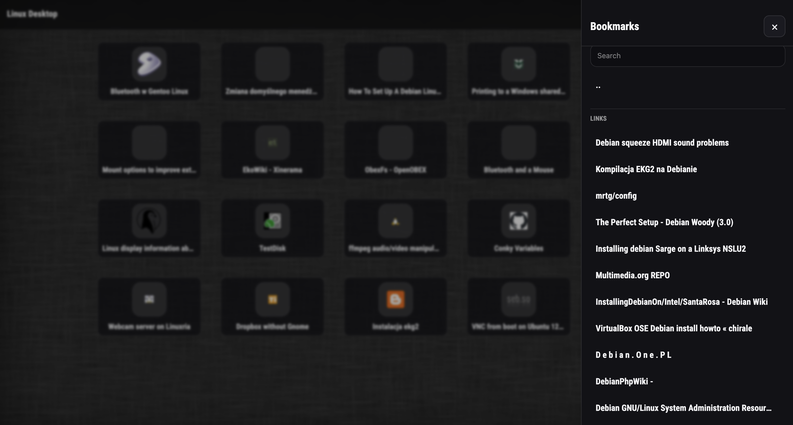
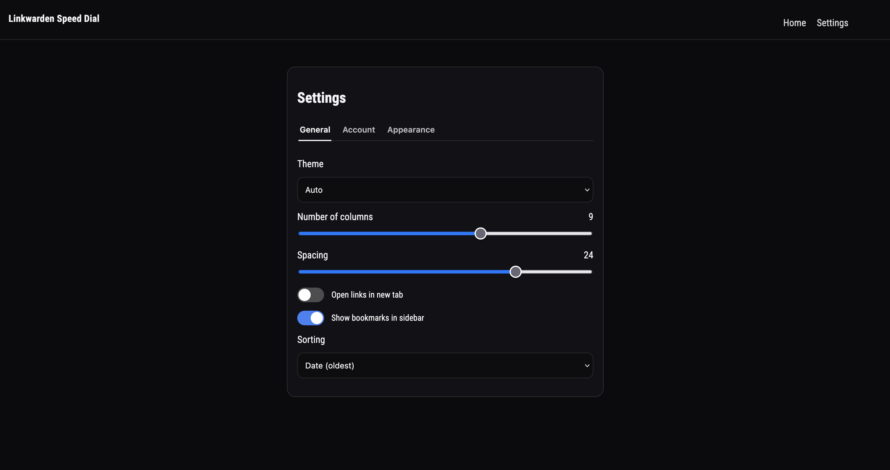

# Linkwarden Speed Dial
A Speed Dial page for browser based on data from Linkwarden.
Links are created based on selected collection.

## Features

- Theme support (auto/dark/light)
- Background setting (image via url/color)
- Bookmarks sidebar (based on data from Linkwarden)
- Data is stored locally (local storage)

## Screenshots







## Development

App is build with Flask, in Python environment. It uses HTML and CSS, templates are written in Jinja2.
In order to run application, create virtual environment:
```shell
python3 -m venv .venv
```
Then, using `pip` install dependencies:
```shell
python3 -m pip install -r requirements.txt
```
Run application with:
```shell
python3 app.py
```